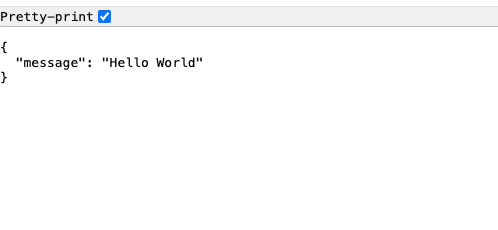

To run the Docker image locally, you’ll need to execute the `docker run` or `docker container run` command after building your image. 

```bash
armagan@ ~/python-docker-example (main?) $ docker run --help

Usage:  docker run [OPTIONS] IMAGE [COMMAND] [ARG...]

Create and run a new container from an image

Aliases:
  docker container run, docker run

Options:
.
.
.
```

## Run the container image

``` bash
docker run --name my-first-container -dp 8000:8000 my-first-image:v1
```
**Example output:**

```bash
armagan@ ~/python-docker-example (main?) $ docker run --name my-first-container -d -p 8000:8000 my-first-image:v1
04e83ca7c1c100c48786add23f9851b51484488d4312e55788056f4838d37790
```
### What just happened?
Docker creates a new container instance from the `my-first-image:v1` image and starts it. The application inside the container is now accessible by visiting [http://localhost:8000](http://localhost:8000) on your browser.

* `--name my-first-container:` Assigns a name to the running container.
* `-p 8000:8000:` Maps port 8000 of the container to port 8000 on the host. This allows you to access the application on port 8000 from the host.
* `-d (short for --detach):` Runs the container in the background. This means that Docker starts your container and returns you to the terminal prompt.
* `my-first-image:v1`: Specifies the image and the tag (version) to run.


#### Browser Output
<div style={{textAlign: 'left'}}>

</div>

## See Running Containers

Run the following command in a terminal to list your containers.

```bash
docker ps
```
or 
``` bash
docker container ls
```

**Example output:**
```bash
armagan@ ~/python-docker-example (main?) $ docker container ls
CONTAINER ID   IMAGE               COMMAND                  CREATED         STATUS         PORTS                    NAMES
3e9479398239   my-first-image:v1   "uvicorn app:app --h…"   6 seconds ago   Up 5 seconds   0.0.0.0:8000->8000/tcp   my-first-container
```