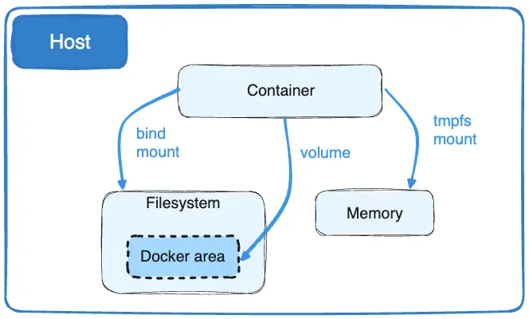

## (Named) Volumes

Named volumes are specifically designed to persist data generated and used by containers. While [bind volumes](managing-bind-volumes) are relatively easier to get start with, Volumes offer several key advantages:

* Volumes can be created and managed using Docker CLI commands or the Docker API.
* Volumes are easier to back up or migrate compared to bind mounts.
* Volume drivers let you use remote storage servers and can be more safely shared among multiple containers
* New volumes can have their content pre-populated by a container.

<div style={{textAlign: 'left'}}>

</div>

**Source**: [Docker Volume Documentation](https://docs.docker.com/engine/storage/volumes/)

### Create Volume
To create a named volume, use the `docker volume create` command:

```bash
docker volume create my-first-volume
```
This creates a volume named `my-first-volume`, which Docker will store in its internal storage directory.

### List Volumes

To view all volumes, use:
```bash
docker volume ls
```
**Example output:**
```bash
armagan@ ~/python-docker-example (main?) $ docker volume ls
DRIVER    VOLUME NAME
local     my-first-volume
```
### Remove a Volume
If a volume is no longer in use, you can remove it with:

```bash
docker volume rm my-first-volume
```
:::warning
Be cautious: removing a volume deletes all data stored in it. Make sure it’s no longer attached to any containers.
:::

### Start Container with a volume

Now, let’s start a container and attach it to the named volume we created. 

```bash
docker run -d \
  --name my-first-container-with-named-volume \
  --mount source=my-first-volume,target=/app/data \
  my-first-image:v1 \
  sh -c "echo 'Hello, Docker Volume' > /app/data/hello.txt"
```
#### What just happened?

* `--mount source=my-first-volume,target=/app/data:` Attaches the `my-first-volume` volume to the `/app/data` directory in the container. Any data written in the container will persist in the volume.
* `sh -c "echo 'Hello, Docker Volume' > /app/data/hello.txt"`: Writes "Hello, Docker Volume" to a file in the volume.

### Check Data inside the container

To confirm that the bind mount is working, execute a shell inside the container and view the data:
``` bash
docker exec -it my-first-container-with-volume bash
```
Once inside the container, list the contents of the /app/data directory:
```
ls /app/data
cat /app/data/hello.txt
```
You should see hello.txt and its contents (Hello from the host), confirming the host directory is successfully mounted.

```bash
app@3deeb1c8f37f:/app$ ls /app/data/
hello.txt
app@3deeb1c8f37f:/app$ cat /app/data/hello.txt
Hello from the host
```
Run `CTRL+D` to exit from container shell.

### Using `docker inspect` to verify the Volume
To see detailed information about a specific volume, use:

```bash
docker volume inspect my-first-volume
```
**Example output:**
``` json
[
    {
        "CreatedAt": "2024-10-30T00:11:03Z",
        "Driver": "local",
        "Labels": null,
        "Mountpoint": "/var/lib/docker/volumes/my-first-volume/_data",
        "Name": "my-first-volume",
        "Options": null,
        "Scope": "local"
    }
]
```
#### What just happened?
* `CreatedAt:` Indicates the exact time when the volume was created, in UTC (Coordinated Universal Time).
* `Driver:` Shows the storage driver used for the volume, which is `local` by default. The local driver stores the volume on the host machine, typically in Docker’s storage directory.
* `Mountpoint:` Specifies the exact path on the host where the volume data is stored. In this example, it’s located in Docker's storage area at `/var/lib/docker/volumes/my-first-volume/_data`. This path is where all data for the volume is physically stored on the host.
* `Scope:` Defines the scope of the volume. `local` means it’s specific to the local Docker engine, and it is only accessible to containers on this host.