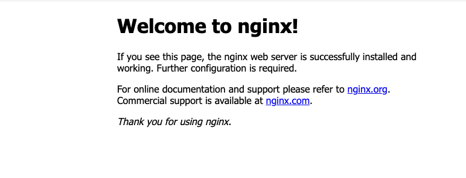

## Where You Can Find Container Images?

Container images can be found in various public registries, including:

- **Docker Hub**: The largest and most popular container registry that hosts a vast array of both official and user-submitted images.
- **Quay.io**: A public registry developed by CoreOS, which is now part of Red Hat. It includes features such as security scanning of images.
- **Others**: There are other registries such as the Google Container Registry (GCR), Microsoft Container Registry (MCR), Amazon ECR Public Gallery and more.

:::warning 
By default, the Docker engine searches for images on DockerHub unless you explicitly specify a different registry in the image name.
:::

## Let's Deploy an Offical Image

This guide explains how to pull a Docker image from a public repository and run it. We'll use the [official Nginx image from DockerHub](https://hub.docker.com/_/nginx) as an example.

### Pulling the Nginx Image

To pull the nginx image from Docker Hub, which is a public repository, use the following command:

```bash
docker pull nginx
```

However, it's important to note that this command will default to pulling the image with the `latest` tag. To specify a particular version, such as `stable`, you need to include the version tag explicitly in your command:

```bash
docker pull nginx:stable
```

### Running the Nginx Container

Once the image is pulled, you can run a container based on that image:

```bash
docker run --name my-nginx -p 8080:80 -d nginx:stable
```

### What just happened?

Docker creates a new container instance from the nginx:stable image from DockerHub and starts it. The application inside the container is now accessible by visiting [http://localhost:8080](http://localhost:8080) on your browser.

Here’s what each option means:

* `--name my-nginx:` Assigns the name my-nginx to your container.
* `-p 8080:80:` Maps port 80 of the nginx container to port 8080 on your host.
* `-d (short for --detach):` Runs the container in the background. This means that Docker starts your container and returns you to the terminal prompt.
* `nginx:stable:` Specifies the image and the tag (version) to run. By default, the Docker engine searches for images on DockerHub unless you explicitly specify a different registry in the image name.

#### Browser Output
<div style={{textAlign: 'left'}}>

</div>


## Bonus Points

1. Try running the container without pulling the image. Explain what happened.
2. Try pulling the same image from [Amazon ECR Public Gallery](https://gallery.ecr.aws/nginx/nginx).