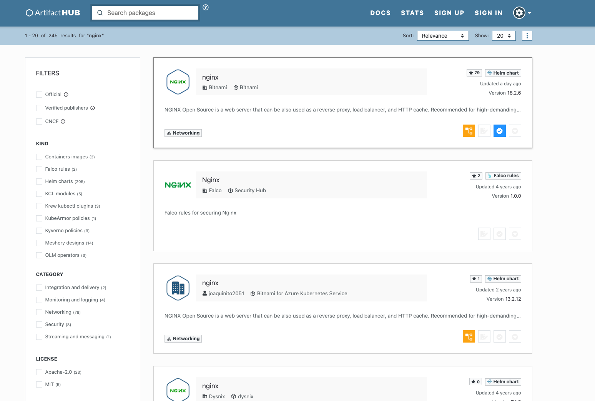

## Serching Helm Charts

To begin working with Helm, you first need to configure your Helm repository. Artifact Hub is an excellent resource to explore available Helm repositories and find detailed installation instructions.

For example, to search for the `nginx` chart on the Helm Hub (now part of Artifact Hub), you can use the Helm command-line tool

```bash
armagan@ ~ $ helm search hub nginx
URL                                               	CHART VERSION	APP VERSION                            	DESCRIPTION
https://artifacthub.io/packages/helm/wiremind/n...	2.1.1        	                                       	An NGINX HTTP server
https://artifacthub.io/packages/helm/ashu-nginx...	0.1.0        	1.16.0                                 	A Helm chart for Kubernetes
https://artifacthub.io/packages/helm/zrepo-test...	5.1.5        	1.16.1                                 	Chart for the nginx server
....
https://artifacthub.io/packages/helm/bitnami-ak...	13.2.12      	1.23.2                                 	NGINX Open Source is a web 
https://artifacthub.io/packages/helm/bitnami/nginx	18.2.6       	1.27.3                                 	NGINX Open Source is a web server that can be a...
https://artifacthub.io/packages/helm/jfrog/nginx  	15.1.5       	1.25.2                                 	NGINX Open Source is a web server that can be a...
.....
```
or [ArtifactHub.io](https://artifacthub.io/) webpage.



Bitnami charts are a trusted source for secure and up-to-date applications. Therefore, using Bitnami charts can be considered as a good practice.

## Setting Up Repositories

### Add Repository
To search for `nginx` charts hosted by Bitnami, ensure you have added the Bitnami repository: 

```bash
helm repo add bitnami https://charts.bitnami.com/bitnami

"bitnami" has been added to your repositories
```
### Update Your Repositories
It is also a good practice to update the available repositories before installing charts:

```bash
helm repo update

...Successfully got an update from the "bitnami" chart repository
```
### Search for `nginx` in the Bitnami Repository

```bash
armagan@ ~ $ helm search repo bitnami/nginx

NAME                            	CHART VERSION	APP VERSION	DESCRIPTION
bitnami/nginx                   	18.2.6       	1.27.3     	NGINX Open Source is a web server that can be a...
bitnami/nginx-ingress-controller	11.5.4       	1.11.3     	NGINX Ingress Controller is an Ingress controll...
bitnami/nginx-intel             	2.1.15       	0.4.9      	DEPRECATED NGINX Open Source for Intel is a lig...
```

Here, we would like to deploy `bitnami/nginx:18.2.6`.

## Installing the Nginx Helm Chart from Bitnami Repository

### Fetch the Default `values.yaml` File

We first need to fetch the default values of the nginx chart and customize it if necessary. You can use the following command:

```bash
armagan@\ ~ $ helm show values bitnami/nginx > values.yaml
```
This command downloads the default values of the nginx chart and saves them to a file named `values.yaml` in your current directory. You can then open this file in a text editor to make any necessary changes.

```bash
armagan@\ ~ $ vim values.yaml

# Copyright Broadcom, Inc. All Rights Reserved.
# SPDX-License-Identifier: APACHE-2.0

## @section Global parameters
## Global Docker image parameters
## Please, note that this will override the image parameters, including dependencies, configured to use the global value
## Current available global Docker image parameters: imageRegistry, imagePullSecrets and storageClass

## @param global.imageRegistry Global Docker image registry
## @param global.imagePullSecrets Global Docker registry secret names as an array
##
global:
  imageRegistry: ""
  ## E.g.
  ## imagePullSecrets:
  ##   - myRegistryKeySecretName
  ##
  imagePullSecrets: []
  ## Compatibility adaptations for Kubernetes platforms
  ##
  compatibility:
    ## Compatibility adaptations for Openshift
    ##
    openshift:
      ## @param global.compatibility.openshift.adaptSecurityContext Adapt the securityContext sections of the deployment to make them compatible with Openshift restricted-v2 SCC: remove runAsUser, runAsGroup and fsGroup and let the platform use their allowed default IDs. Possible values: auto (apply if the detected running cluster is Openshift), force (perform the adaptation always), disabled (do not perform adaptation)
      ##
      adaptSecurityContext: auto

.......
```

### Modify the Values File

Now, open the `values.yaml` file with your preferred text editor. Here, we want to customize:

``` yaml
nameOverride: "my-first-helm-chart"
replicaCount: 3
service:
  type: ClusterIP
```
Make sure to save your changes.

### Deploy the Chart with the Custom Values

Once you've configured your `values.yaml` file with the desired settings, you can deploy the nginx chart using these custom values:

```bash
armagan@ ~ $ helm install my-nginx bitnami/nginx -f values.yaml
NAME: my-nginx
LAST DEPLOYED: Thu Nov 28 04:50:32 2024
NAMESPACE: k8s-training-25
STATUS: deployed
REVISION: 1
TEST SUITE: None
NOTES:
CHART NAME: nginx
CHART VERSION: 18.2.6
APP VERSION: 1.27.3

** Please be patient while the chart is being deployed **
NGINX can be accessed through the following DNS name from within your cluster:

    my-nginx-my-first-helm-chart.k8s-training-25.svc.cluster.local (port 80)

To access NGINX from outside the cluster, follow the steps below:

1. Get the NGINX URL by running these commands:

    export SERVICE_PORT=$(kubectl get --namespace k8s-training-25 -o jsonpath="{.spec.ports[0].port}" services my-nginx-my-first-helm-chart)
    kubectl port-forward --namespace k8s-training-25 svc/my-nginx-my-first-helm-chart ${SERVICE_PORT}:${SERVICE_PORT} &
    echo "http://127.0.0.1:${SERVICE_PORT}"

WARNING: There are "resources" sections in the chart not set. Using "resourcesPreset" is not recommended for production. For production installations, please set the following values according to your workload needs:
  - cloneStaticSiteFromGit.gitSync.resources
  - resources
+info https://kubernetes.io/docs/concepts/configuration/manage-resources-containers/
```
### Verify the Deployment
After deploying, you can check the status of your release to ensure it's running correctly:

```bash
armagan@ ~ $ helm list
NAME    	NAMESPACE      	REVISION	UPDATED                             	STATUS  	CHART       	APP VERSION
my-nginx	k8s-training-25	1       	2024-11-28 04:50:32.769394 +0100 CET	deployed	nginx-18.2.6	1.27.3
```
or

```bash
armagan@ ~ $ helm status my-nginx

NAME: my-nginx
LAST DEPLOYED: Thu Nov 28 04:50:32 2024
NAMESPACE: k8s-training-25
STATUS: deployed
REVISION: 1
TEST SUITE: None
NOTES:
CHART NAME: nginx
CHART VERSION: 18.2.6
APP VERSION: 1.27.3

```
You can also check the Kubernetes services to confirm that the nginx is deployed as you defined. 

```bash
armagan@ ~ $ kubectl get pods
NAME                                               READY   STATUS    RESTARTS   AGE
my-nginx-my-first-helm-chart-79d4c69646-n4mr9      1/1     Running   0          2m35s
my-nginx-my-first-helm-chart-79d4c69646-tlpww      1/1     Running   0          2m35s
my-nginx-my-first-helm-chart-79d4c69646-xhdf8      1/1     Running   0          2m35s
```

## Uninstall Your First Helm Chart

To uninstall a chart, simply run:

```bash
armagan@ ~ $ helm list
NAME    	NAMESPACE      	REVISION	UPDATED                             	STATUS  	CHART       	APP VERSION
my-nginx	k8s-training-25	1       	2024-11-28 04:50:32.769394 +0100 CET	deployed	nginx-18.2.6	1.27.3

armagan@ ~ $ helm uninstall my-nginx
release "my-nginx" uninstalled
```