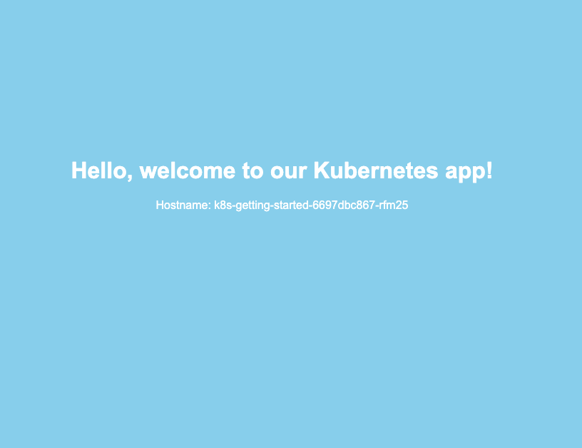

Now, let's intentionally break your deployment by using a faulty image. Since we set `strategy.type: Recreate` in our initial deployment, all pods will be updated at once, simulating a complete outage. 

We’ll update the deployment to use a broken image (`armagankaratosun/k8s-getting-started:broken`) to demonstrate Kubernetes' rollback feature.

## Update the Deployment

Edit the `deployment.yaml` file to update the container image part:

```yaml 
spec:
  containers:
    - name: k8s-getting-started
      image: armagankaratosun/k8s-getting-started:broken  # New (broken) image
      ports:
        - containerPort: 8080
```

##  Apply the Initial Deployment

To deploy the broken image, run:

```
kubectl apply -f deployment.yaml -n <your-namespace>
```

### Example Output

```
armagan@ ~ $ kubectl apply -f k8s-getting-started/Deployments/deployment.yaml -n <your-namespace>
deployment.apps/k8s-getting-started configured
```

##  Observe the Failed Update

You’ll see all of your pods will be `Terminating` all at once, leaving the service unresponsive:

```bash
armagan@ ~ $ kubectl get pods -n <your-namespace>

NAME                                   READY   STATUS        RESTARTS   AGE
k8s-getting-started-6697dbc867-9r49d   1/1     Terminating   0          17m
k8s-getting-started-6697dbc867-rfm25   1/1     Terminating   0          17m
k8s-getting-started-6697dbc867-tjr4w   1/1     Terminating   0          17m
k8s-getting-started-6697dbc867-w5jbb   1/1     Terminating   0          17m
k8s-getting-started-6697dbc867-zrp2z   1/1     Terminating   0          17m
```

After attempting to start the new image, the pods enter `CrashLoopBackOff` or `Error` states, indicating an issue with the image:
``` bash
NAME                                   READY   STATUS             RESTARTS      AGE
k8s-getting-started-68f74ccc47-4c4rh   0/1     Error              4 (50s ago)   94s
k8s-getting-started-68f74ccc47-4g9zb   0/1     CrashLoopBackOff   3 (43s ago)   94s
k8s-getting-started-68f74ccc47-dlbhp   0/1     CrashLoopBackOff   3 (49s ago)   94s
k8s-getting-started-68f74ccc47-jtdds   0/1     CrashLoopBackOff   3 (41s ago)   94s
k8s-getting-started-68f74ccc47-p5gkm   0/1     CrashLoopBackOff   3 (42s ago)   94s
armagan@darwin ~ $
```

Attempt to access the service at [http://localhost:8080](http://localhost:8080) and you’ll receive an error:

### Example Output

```
an error occurred forwarding 8080 -> 8080: error forwarding port 8080 to pod  
IPv4: dial tcp4 127.0.0.1:8080: connect: connection refused IPv6 dial tcp6 [::1]:8080: connect: connection refused
error: lost connection to pod
```

## View Deployment Revisions

Before rolling back, view the revision history to confirm the different versions of the deployment:

```bash
kubectl rollout history deployment/k8s-getting-started -n <your-namespace>
```

### Example Output

You should see output similar to this:

```bash
deployment.apps/k8s-getting-started
REVISION  CHANGE-CAUSE
1         <none>
2         <none>
```

Each revision represents a different version of the deployment. In this case, revision 1 is the initial, stable version, and revision 2 corresponds to the broken image update.

## Roll Back to the Previous Version

To revert to the stable version (revision 1), use the rollback command:

```bash
kubectl rollout undo deployment/k8s-getting-started --to-revision=1 -n <your-namespace>
```
### Example Output

```bash
armagan@ ~ $ kubectl rollout undo deployment/k8s-getting-started --to-revision=1
deployment.apps/k8s-getting-started rolled back
```

Verify that the pods are now running with the stable image:

```bash
armagan@ ~ $ kubectl get pods
NAME                                   READY   STATUS    RESTARTS   AGE
k8s-getting-started-6697dbc867-7lss8   1/1     Running   0          68s
k8s-getting-started-6697dbc867-b9nst   1/1     Running   0          67s
k8s-getting-started-6697dbc867-jnfjq   1/1     Running   0          68s
k8s-getting-started-6697dbc867-m6dz4   1/1     Running   0          67s
k8s-getting-started-6697dbc867-wd24j   1/1     Running   0          68s
```

Now, the app should be accessible again at [http://localhost:8080](http://localhost:8080)


