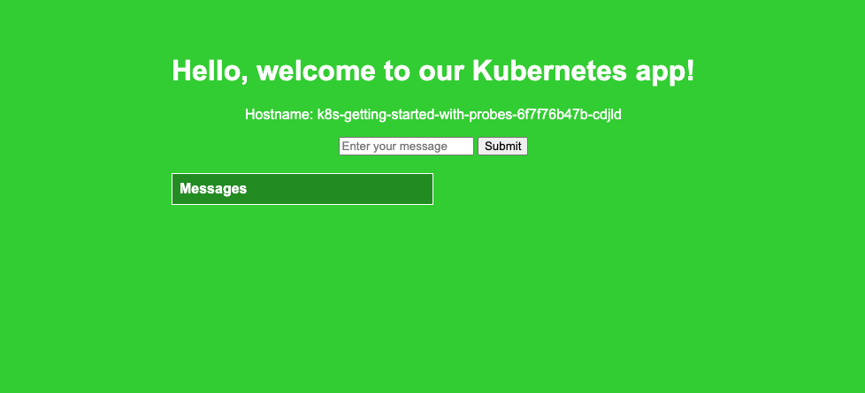

Source code: [k8s-getting-started GitHub Repository](https://github.com/armagankaratosun/k8s-getting-started)

You can copy/paste the YAML manifests from this guide, or clone the repository to edit and use the manifests directly.

For this example, we will first create the `ClusterIP` service to have internal serivce ready to forward requests to pods.

## Create a ClusterIP Service 

```yaml
apiVersion: v1
kind: Service
metadata:
  name: k8s-getting-started-with-probes-service
spec:
  type: ClusterIP                       # Internal-only access within the cluster
  selector:
    app: k8s-getting-started-with-probes     # Matches the label of the Deployment
  ports:
    - protocol: TCP
      port: 8080                           # Port exposed by the service
      targetPort: 8080                   # Port on the container that the app is running on
```

### Example Output

Check the `k8s-getting-started-with-probes-service ` service.

```bash
armagan@ ~ $ kubectl get svc
NAME                                      TYPE           CLUSTER-IP      EXTERNAL-IP       PORT(S)        AGE
k8s-getting-started-with-probes-service   ClusterIP      10.67.244.249   <none>            8080/TCP       119m
```

## Create an Ingress to Expose your ClusterIP service

Now we need an ingress manifest to expose `k8s-getting-started-with-probes` service to the outside world. Please pay attention to `backend.service` to match with the `ClusterIP` service.

```yaml
apiVersion: networking.k8s.io/v1
kind: Ingress
metadata:
  name: k8s-getting-started-ingress-probes
  annotations:
    nginx.ingress.kubernetes.io/rewrite-target: /  # Ensures paths are properly routed to the service
spec:
  rules:
  - host: "<yourname>.<yourdomain>.com"  # Replace <yourname>.<yourdomain>.com with your specific domain
    http:
      paths:
      - path: /
        pathType: Prefix
        backend:
          service:
            name: k8s-getting-started-with-probes-service  # The name of the ClusterIP service for your app
            port:
              number: 8080  # Port of the service as defined in the service.yaml file
```
### Example Output

```bash
armagan@ ~ $ kubectl apply -f ingress.yaml
ingress.networking.k8s.io/k8s-getting-started-ingress-probes created
```

```bash
armagan@ ~ $ kubectl get ingress
NAME                          CLASS   HOSTS                                                        ADDRESS                                               PORTS   AGE
k8s-getting-started-ingress-probes   nginx   "<yourname>.<yourdomain>.com"   10.0.0.1,10.0.0.2,10.0.0.3,10.0.0.4,10.0.0.5   80      77s
```

Now you can try to access the service from the `HOST: <yourname>.<yourdomain>.com`

#### Browser Output


This output is expected, since we did not deploy the application yet.

## Deploy the application 

Below are the YAML manifests for a Kubernetes Deployment using a demo application, implementing healtchecks under `/healthz`. (Located at `Deployments/deployment-probes.yaml`)

```yaml
apiVersion: apps/v1
kind: Deployment
metadata:
  name: k8s-getting-started-with-probes
  labels:
    app: k8s-getting-started-with-probes
spec:
  replicas: 2
  strategy:
    type: RollingUpdate
    rollingUpdate:
      maxUnavailable: 0
      maxSurge: 1
  selector:
    matchLabels:
      app: k8s-getting-started-with-probes
  template:
    metadata:
      labels:
        app: k8s-getting-started-with-probes
    spec:
      containers:
        - name: k8s-getting-started-with-probes
          image: armagankaratosun/k8s-getting-started:v4
          imagePullPolicy: Always
          ports:
            - containerPort: 8080
          livenessProbe:
            httpGet:
              path: /   
              port: 8080
            successThreshold: 1 
            failureThreshold: 3
          readinessProbe:
            httpGet:
              path: /healthz   # Readiness check on the /healthz endpoint
              port: 8080
            successThreshold: 1 
            failureThreshold: 3
```
Here , The `Liveness Probe `checks if your application is still running. If this check fails several times, Kubernetes will restart the container to try to fix the problem.

* **httpGet:** This specifies that Kubernetes should use an HTTP GET request to check the liveness of the container.
* **path: /:** This is the URL path that Kubernetes will access on the container's IP address and specified port. 
* **port: 8080:** This is the container port on which the probe request will be sent.
* successThreshold: 1: This means the probe needs to succeed only once to be considered successful. Once this probe succeeds, the container is considered healthy.
* **failureThreshold: 3:** This is the number of times Kubernetes will try the liveness probe before giving up. After three consecutive failures, Kubernetes decides the container is not alive, and it needs to be restarted.

The `Readiness Probe` determines if your application is ready to handle requests. If this check fails, Kubernetes stops sending traffic to the pod until it passes the probe, ensuring that only "ready" pods receive traffic.

* **httpGet:** This specifies the method of the health check, similar to the liveness probe.
* **path: /healthz:** This path is specifically set to `/healthz` for readiness check.
* **port: 8080:** The port where the HTTP GET request is sent, which is the same as the liveness probe.
* **successThreshold:** 1: This indicates that the probe needs to succeed only once to change the pod's status to ready.
* **failureThreshold: 3:** This defines the number of consecutive failures that must occur for the readiness probe to consider the container not ready. Kubernetes will try the readiness probe three times, and if all attempts fail, the pod is marked as not ready and there will be no traffic forwarded to the pod.

### Example Output

```bash
armagan@ ~ $ kubectl apply -f probes.yaml
deployment.apps/k8s-getting-started-with-probes created
```

Now you can see the pods are `STATUS`: `Running` but they are not `READY`.

```bash
armagan@ ~ $ kubectl get pods
NAME                                               READY   STATUS    RESTARTS   AGE
k8s-getting-started-with-probes-6f7f76b47b-fg6qj   0/1     Running   0          18s
k8s-getting-started-with-probes-6f7f76b47b-zp6kc   0/1     Running   0          18s
```

You can confirm this (and also figure out what went wrong) with `kubectl describe pod` command.

```yaml
armagan@darwin ~ $ kubectl describe pod k8s-getting-started-with-probes-6f7f76b47b-zp6kc
Name:             k8s-getting-started-with-probes-6f7f76b47b-zp6kc
Namespace:        k8s-training-25
Priority:         0
Service Account:  default
...

Containers:
  k8s-getting-started-with-probes:
    Container ID:   containerd://ebe38c56a1de54eaf1288b328da82bca3a66dbd896abc04774688079fbf92dd7
    Image:          armagankaratosun/k8s-getting-started:v4
    Image ID:       docker.io/armagankaratosun/k8s-getting-started@sha256:0b3993ffe6b8ff5fe689583e3da1c8143dbe920eddb893f563aac58ee50fda7c
    Port:           8080/TCP
    Host Port:      0/TCP
    State:          Running
      Started:      Thu, 28 Nov 2024 04:08:51 +0100
    Ready:          False
    Restart Count:  0
    Liveness:       http-get http://:8080/ delay=0s timeout=1s period=10s #success=1 #failure=3
    Readiness:      http-get http://:8080/healthz delay=0s timeout=1s period=10s #success=1 #failure=3
    Environment:    <none>
...
Conditions:
  Type                        Status
  PodReadyToStartContainers   True
  Initialized                 True
  Ready                       False
  ContainersReady             False
  PodScheduled                True
...
Events:
  Type     Reason     Age               From               Message
  ----     ------     ----              ----               -------
  Normal   Scheduled  19s               default-scheduler  Successfully assigned k8s-training-25/k8s-getting-started-with-probes-6f7f76b47b-zp6kc to k8s-training-generic-worker-pool-mcvxl-wtfkw.datacoord.ewc
  Normal   Pulling    18s               kubelet            Pulling image "armagankaratosun/k8s-getting-started:v4"
  Normal   Pulled     17s               kubelet            Successfully pulled image "armagankaratosun/k8s-getting-started:v4" in 1.092s (1.092s including waiting). Image size: 52293103 bytes.
  Normal   Created    17s               kubelet            Created container k8s-getting-started-with-probes
  Normal   Started    16s               kubelet            Started container k8s-getting-started-with-probes
  Warning  Unhealthy  16s               kubelet            Readiness probe failed: Get "http://10.66.250.145:8080/healthz": dial tcp 10.66.250.145:8080: connect: connection refused
  Warning  Unhealthy  9s (x3 over 15s)  kubelet            Readiness probe failed: HTTP probe failed with statuscode: 503
  Warning  Unhealthy  9s                kubelet            Liveness probe failed: HTTP probe failed with statuscode: 503
```
You can check `Events`, `Conditions` and `Containers.Ready` and `Containers.Restart Count` to see both `Readiness` and `Liveness` probes are failing.

#### Browser Output


### Wait Until the Liveness and Readiness Probes Succeed

Now, simply keep an eye on the pods. After the initialization phase, the pods should reach a `READY` status.

:::warning
However, this might not be the case for all pods! Pods can get stuck in a  `STATUS:CrashLoopBackoff` if there are issues with:
1) The pod itself,
2) The liveness probe,
3) Or both.
:::
```
armagan@ ~ $ kubectl get pods
NAME                                               READY   STATUS    RESTARTS   AGE
k8s-getting-started-with-probes-6f7f76b47b-fg6qj   1/1     Running   0          5m58s
k8s-getting-started-with-probes-6f7f76b47b-zp6kc   1/1     Running   0          5m58s
```

and now `Conditions` and `Containers.Ready` should be the either `True` or `Running`.

```yaml
armagan@darwin ~ $ kubectl describe pod k8s-getting-started-with-probes-6f7f76b47b-zp6kc
Name:             k8s-getting-started-with-probes-6f7f76b47b-zp6kc
Namespace:        k8s-training-25
Priority:         0
...
Containers:
  k8s-getting-started-with-probes:
    Container ID:   containerd://ebe38c56a1de54eaf1288b328da82bca3a66dbd896abc04774688079fbf92dd7
    Image:          armagankaratosun/k8s-getting-started:v4
    Image ID:       docker.io/armagankaratosun/k8s-getting-started@sha256:0b3993ffe6b8ff5fe689583e3da1c8143dbe920eddb893f563aac58ee50fda7c
    Port:           8080/TCP
    Host Port:      0/TCP
    State:          Running
      Started:      Thu, 28 Nov 2024 04:08:51 +0100
    Ready:          True
    Restart Count:  0
    Liveness:       http-get http://:8080/ delay=0s timeout=1s period=10s #success=1 #failure=3
    Readiness:      http-get http://:8080/healthz delay=0s timeout=1s period=10s #success=1 #failure=3
    Environment:    <none>
...
Conditions:
  Type                        Status
  PodReadyToStartContainers   True
  Initialized                 True
  Ready                       True
  ContainersReady             True
  PodScheduled                True
...
Events:
  Type     Reason     Age                From               Message
  ----     ------     ----               ----               -------
  Normal   Scheduled  10m                default-scheduler  Successfully assigned k8s-training-25/k8s-getting-started-with-probes-6f7f76b47b-zp6kc to k8s-training-generic-worker-pool-mcvxl-wtfkw.datacoord.ewc
  Normal   Pulling    10m                kubelet            Pulling image "armagankaratosun/k8s-getting-started:v4"
  Normal   Pulled     10m                kubelet            Successfully pulled image "armagankaratosun/k8s-getting-started:v4" in 1.092s (1.092s including waiting). Image size: 52293103 bytes.
  Normal   Created    10m                kubelet            Created container k8s-getting-started-with-probes
  Normal   Started    10m                kubelet            Started container k8s-getting-started-with-probes
  Warning  Unhealthy  10m                kubelet            Readiness probe failed: Get "http://10.66.250.145:8080/healthz": dial tcp 10.66.250.145:8080: connect: connection refused
  Warning  Unhealthy  10m (x3 over 10m)  kubelet            Readiness probe failed: HTTP probe failed with statuscode: 503
  Warning  Unhealthy  10m (x2 over 10m)  kubelet            Liveness probe failed: HTTP probe failed with statuscode: 503
```

Now let's check the browser output again.
#### Browser Output


## Bonus Points
1) Identify the reasons behind the failure of the Liveness and Readiness probes in the pod.
2) Identify a method to access the application's /healthz endpoint.
3) Attempt to resolve the issues.


