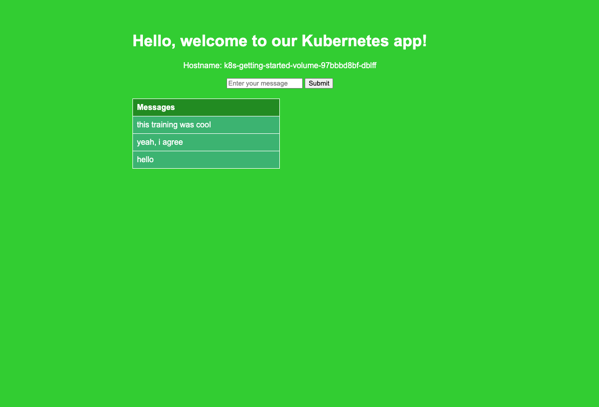

StorageClasses define how Kubernetes creates and manages volumes. In this scenario, we explore how to use StorageClasses and PersistentVolumeClaims (PVCs) to allocate storage resources.

Source code: [k8s-getting-started GitHub Repository](https://github.com/armagankaratosun/k8s-getting-started/blob/main/Deployments/deployment-volume.yaml)

## Checking Available Storage Classes
First, list available StorageClasses to identify which one suits your needs. 

```bash
armagan@ ~ $ kubectl get storageclass
NAME                             PROVISIONER                RECLAIMPOLICY   VOLUMEBINDINGMODE   ALLOWVOLUMEEXPANSION   AGE
csi-cinder-sc-delete (default)   cinder.csi.openstack.org   Delete          Immediate           true                   14d
csi-cinder-sc-retain             cinder.csi.openstack.org   Retain          Immediate           true                   14d
```
### Access Modes

Access modes in Kubernetes define how pods can access a PersistentVolume (PV). Here are the common types:

* **ReadWriteOnce (RWO):** A single pod can mount the volume as read-write.
* **ReadOnlyMany (ROX):** Multiple pods can mount the volume as read-only.
* **ReadWriteMany (RWX):** The volume can be mounted as read-write by many pods simultaneously.

:::warning
When you set the access mode for your application, be sure to check that the StorageClass supports it.
:::

For more detailed information, visit the Kubernetes documentation on [Persistent Volumes at K8s docs](https://kubernetes.io/docs/concepts/storage/persistent-volumes/).

## Create a PVC

A PersistentVolumeClaim (PVC) is required to request a Persistent Volume (PV) from a Storage Class. Below is how to define a PVC in your cluster, requesting 1Gi of storage and using the `csi-cinder-sc-delete` StorageClass to delete the volume automatically when the PVC is deleted. (PVC part of the `Deployments/deployment-volume.yaml`)

```yaml
apiVersion: v1
kind: PersistentVolumeClaim
metadata:
  name: k8s-getting-started-pvc
spec:
  accessModes:
    - ReadWriteOnce                      # The volume can be mounted as read-write by a single node
  storageClassName: csi-cinder-sc-delete # Replace with the name of your storage class
  resources:
    requests:
      storage: 1Gi                       # Requests 1Gi of storage
```

## Deployment Using the PVC

When deploying applications that require persistent storage, you need to reference the PVC within your Deployment configuration. Below is the YAML manifest for mounting the requested storage to a container in a Deployment using the `armagankaratosun/k8s-getting-started:v3` image, which requires persistency. 

(Deployment part of the `Deployments/deployment-volume.yaml`)

```yaml
apiVersion: apps/v1
kind: Deployment
metadata:
  name: k8s-getting-started-volume
  labels:
    app: k8s-getting-started-volume
spec:
  replicas: 1
  selector:
    matchLabels:
      app: k8s-getting-started-volume
  template:
    metadata:
      labels:
        app: k8s-getting-started-volume
    spec:
      containers:
        - name: k8s-getting-started-volume
          image: armagankaratosun/k8s-getting-started:v3  # Updated to v3
          ports:
            - containerPort: 8080
          volumeMounts:
            - name: app-storage               # Attach the PVC as a volume in the container
              mountPath: /data                # Path inside the container where the volume is mounted
      volumes:
        - name: app-storage
          persistentVolumeClaim:
            claimName: k8s-getting-started-volume-pvc  # Reference the PVC created above
```

## Expose the Deployment with a Service

This will create a ClusterIP service, accessible only from within the cluster (or via kubectl port-forward). 

(Service part of the `Deployments/deployment-volume.yaml`)

```yaml
apiVersion: v1
kind: Service
metadata:
  name: k8s-getting-started-volume-service
spec:
  type: ClusterIP                       # Internal-only access within the cluster
  selector:
    app: k8s-getting-started-volume      # Matches the label of the Deployment
  ports:
    - protocol: TCP
      port: 8080                           # Port exposed by the service
      targetPort: 8080                   # Port on the container that the app is running on
```
Now you can use `kubeclt port-forward` again to expose the service locally.

```bash
kubectl port-forward service/k8s-getting-started-volume-service 8080:8080
```

and access the app in your browser at http://localhost:8080

### Example Output

Creating the Deployment manifest

```
armagan@ ~ $ kubectl apply -f deployment-with-volume.yaml
deployment.apps/k8s-getting-started-volume created
```
We now see a deployment called `k8s-getting-started-volume `

```
armagan@ ~ $ kubectl get deployments
NAME                         READY   UP-TO-DATE   AVAILABLE   AGE
k8s-getting-started-volume   1/1     1            1           22s
```

Once we have the deployment in `READY` status, we can check the PVC to see our Persistent Volume Claim.  

```
armagan@ ~ $ kubectl get pvc
NAME                             STATUS   VOLUME                                     CAPACITY   ACCESS MODES   STORAGECLASS           VOLUMEATTRIBUTESCLASS   AGE
k8s-getting-started-volume-pvc   Bound    pvc-b4de2b98-667e-4781-b6e5-def6443ceba9   1Gi        RWO            csi-cinder-sc-delete   <unset>                 13d
```

Status `Bound` means that the PVC is bounded to a Persistent Volume (PV) that is created by the StorageClass automatically.

```
armagan@ ~ $ kubectl get pv
NAME                                       CAPACITY   ACCESS MODES   RECLAIM POLICY   STATUS   CLAIM                                            STORAGECLASS           VOLUMEATTRIBUTESCLASS   REASON   AGE
pvc-b4de2b98-667e-4781-b6e5-def6443ceba9   1Gi        RWO            Delete           Bound    k8s-training-25/k8s-getting-started-volume-pvc   csi-cinder-sc-delete   <unset>
```

### What just happened?

Now the messages that you enter will be stored in a list, which will be a simple txt file stored on the Persistent Volume (PV), provisioned by the Storage Class and reffered by your Persistent Volume Claim (PVC) manifest.

#### Browser Output


### Bonus Points

Verify that the messages are retained persistently by deleting the pods. Is there a way to delete the messages and start from scratch?


