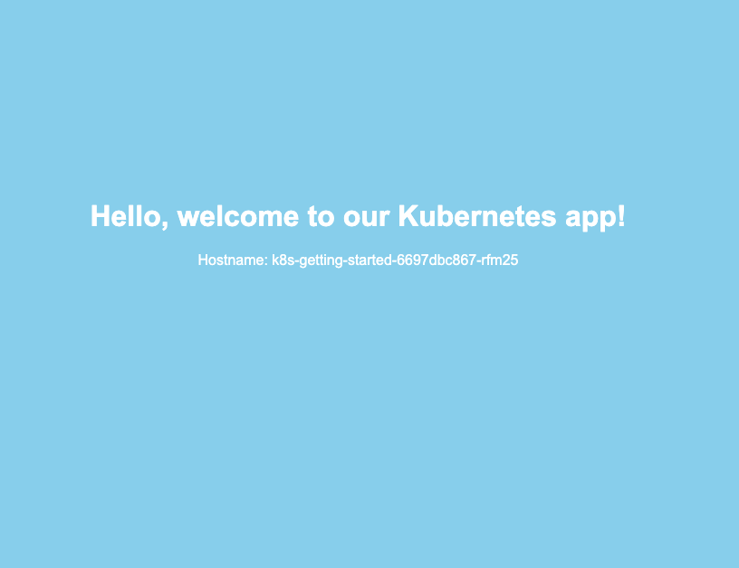

Source code: [k8s-getting-started GitHub Repository](https://github.com/armagankaratosun/k8s-getting-started)

You can copy/paste the YAML manifests from this guide, or clone the repository to edit and use the manifests directly.

## Deploy the application (if you dont already)

Below are the YAML manifests for a Kubernetes Deployment using a demo container image. (Located at `Deployments/deployment.yaml`)

```yaml
apiVersion: apps/v1
kind: Deployment
metadata:
  name: k8s-getting-started
  labels:
    app: k8s-getting-started
spec:
  replicas: 5
  strategy:
    type: Recreate # Specifies the strategy type as "Recreate", meaning that pods will be updated all at once
  selector:
    matchLabels:
      app: k8s-getting-started
  template:
    metadata:
      labels:
        app: k8s-getting-started
    spec:
      containers:
        - name: k8s-getting-started
          image: armagankaratosun/k8s-getting-started:v1
          ports:
            - containerPort: 8080
```

Apply the Initial Deployment
To deploy, run:

`kubectl apply -f deployment.yaml -n <your-namespace>`

### Example Output

```bash
armagan@ ~ $ kubectl apply -f k8s-getting-started/Deployments/deployment.yaml -n <your-namespace>
deployment.apps/k8s-getting-started created
```

You can list the available pods

```bash
armagan@ ~ $ kubectl get pods -n <your-namespace>

NAME                                   READY   STATUS    RESTARTS   AGE
k8s-getting-started-6697dbc867-9r49d   1/1     Running   0          31s
k8s-getting-started-6697dbc867-rfm25   1/1     Running   0          32s
k8s-getting-started-6697dbc867-tjr4w   1/1     Running   0          32s
k8s-getting-started-6697dbc867-w5jbb   1/1     Running   0          31s
k8s-getting-started-6697dbc867-zrp2z   1/1     Running   0          32s
```

## Create a LoadBalancer Service

This will create a LoadBalancer service, accessible by everyone with a public IP address provided by your cloud provider. (Located at `Services/service-loadbalancer.yaml`)

```yaml
apiVersion: v1
kind: Service
metadata:
  name: k8s-getting-started-loadbalancer
spec:
  type: LoadBalancer  # Service type to provision an external IP address
  selector:
    app: k8s-getting-started  # Matches the label of the Deployment
  ports:
    - protocol: TCP
      port: 80           # Port exposed externally
      targetPort: 8080     # Port on the container that the app is running on
```

### Example Output

Check the `k8s-getting-started-loadbalancer` Service and its `EXTERNAL-IP`.
```
armagan@darwin ~ $ kubectl get svc
NAME                                      TYPE           CLUSTER-IP      EXTERNAL-IP       PORT(S)        AGE
k8s-getting-started-loadbalancer          LoadBalancer   10.67.120.80    <your-external-ip>   80:30654/TCP   13d
k8s-getting-started-service               ClusterIP      10.67.176.167   <none>            8080/TCP       13d
```
### What just happened?

The cloud provider provisioned a cloud load balancer to expose your service. Now it is accessible at `EXTERNAL-IP`: `<your-external-ip>`.

Try accessing the service from a browser.

#### Browser Output

