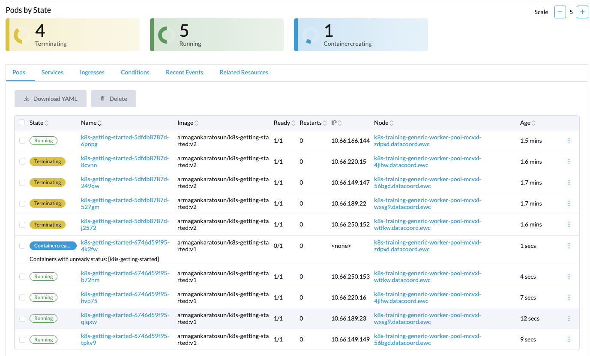
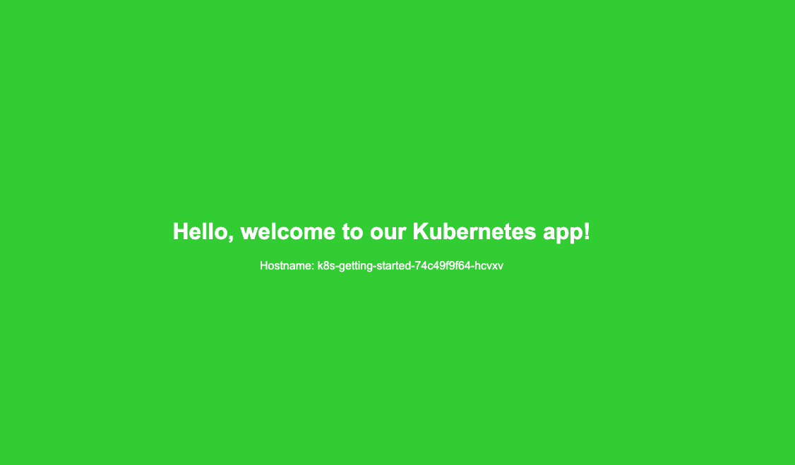

To showcase rolling updates in Kubernetes, we’ll start with a k8s-getting-started deployment using v1 of the application image. Then, we’ll update the deployment to v2, which will change the background color to green.

The RollingUpdate strategy will allow us to update the application gradually, without any downtime.

## Start with the Initial Deployment (v1)

Below is the YAML manifest for `k8s-getting-started` using the `RollingUpdate` strategy. This deployment will start with version `v1`, which has a blue background. (Located at `Deployments/deployment-rolling.yaml`)

```yaml
apiVersion: apps/v1
kind: Deployment
metadata:
  name: k8s-getting-started
  labels:
    app: k8s-getting-started
spec:
  replicas: 5
  strategy:
    type: RollingUpdate            # Sets the update strategy to "RollingUpdate" for gradual updates
    rollingUpdate:
      maxUnavailable: 0            # Ensures no existing pods are terminated until new ones are ready
      maxSurge: 1                  # Allows up to 1 extra pod during the update process for seamless transition
  selector:
    matchLabels:
      app: k8s-getting-started
  template:
    metadata:
      labels:
        app: k8s-getting-started
    spec:
      containers:
        - name: k8s-getting-started
          image: armagankaratosun/k8s-getting-started:v1  # Initial image with blue background
          ports:
            - containerPort: 8080
```

## Apply the Initial Deployment (v1)

To deploy version v1, run:

```bash
kubectl apply -f deployment-rolling.yaml -n <your-namespace>
```

### Example Output

```
armagan@ ~ $ kubectl apply -f k8s-getting-started/Deployments/deployment-rolling.yaml -n <your-namespace>
deployment.apps/k8s-getting-started configured
```

You can list the available pods 

```
armagan@ ~ $ kubectl get pods -n <your-namespace>

NAME                                   READY   STATUS    RESTARTS   AGE
k8s-getting-started-6697dbc867-7lss8   1/1     Running   0          17m
k8s-getting-started-6697dbc867-b9nst   1/1     Running   0          17m
k8s-getting-started-6697dbc867-jnfjq   1/1     Running   0          17m
k8s-getting-started-6697dbc867-m6dz4   1/1     Running   0          17m
k8s-getting-started-6697dbc867-wd24j   1/1     Running   0          17m
```
### What just happened?

Kubernetes has now updated our deployment configuration, setting the update strategy to RollingUpdate to manage the upgrade process gradually.

* `RollingUpdate`: This strategy replaces pods gradually, reducing disruption. Pods are updated one or a few at a time, minimizing downtime by allowing new pods to be ready before old pods are taken offline.
* `maxUnavailable: 0`: Ensures no pods are terminated until the new pods are running. This helps maintain 100% availability.
* `maxSurge: 1`: Allows 1 extra pod during the update, so a new pod can be created before terminating an old one. This extra capacity supports seamless scaling during updates.

## Update to `v2` to Trigger a Rolling Update

Now, let’s update the deployment to use version `v2`, which has a green background. This gradual transition will allow us to observe the `RollingUpdate` strategy in action.

Edit the image in deployment.yaml to use `v2`:

```yaml
spec:
      containers:
        - name: k8s-getting-started
          image: armagankaratosun/k8s-getting-started:v2  # Updated to v2 with green background
          ports:
            - containerPort: 8080
```

### Example Output

Kubernetes will update one pod at a time, creating a new pod with `v2` (green background) and waiting for it to be ready before terminating an old pod with `v1` (blue background). This process repeats until all pods are updated to v2.

```
armagan@ ~ $ kubectl apply -f k8s-getting-started/Deployments/deployment-rolling.yaml -n <your-namespace>
deployment.apps/k8s-getting-started configured
```

You can list the available pods 

```
armagan@ ~ $ kubectl get pods -n <your-namespace> -o wide

NAME                                   READY   STATUS        RESTARTS   AGE   IP              NODE                                                         NOMINATED NODE   READINESS GATES
k8s-getting-started-5dfdb8787d-249qw   1/1     Running       0          36s   10.66.149.147   k8s-training-generic-worker-pool-mcvxl-56bgd.datacoord.ewc   <none>           <none>
k8s-getting-started-5dfdb8787d-527gm   1/1     Running       0          33s   10.66.189.22    k8s-training-generic-worker-pool-mcvxl-wxsg9.datacoord.ewc   <none>           <none>
k8s-getting-started-5dfdb8787d-6pnpg   1/1     Running       0          23s   10.66.166.144   k8s-training-generic-worker-pool-mcvxl-zdpxd.datacoord.ewc   <none>           <none>
k8s-getting-started-5dfdb8787d-8cvnn   1/1     Running       0          30s   10.66.220.15    k8s-training-generic-worker-pool-mcvxl-4jlhw.datacoord.ewc   <none>           <none>
k8s-getting-started-5dfdb8787d-j2572   1/1     Running       0          27s   10.66.250.152   k8s-training-generic-worker-pool-mcvxl-wtfkw.datacoord.ewc   <none>           <none>
k8s-getting-started-6697dbc867-7lss8   1/1     Terminating   0          21m   10.66.189.21    k8s-training-generic-worker-pool-mcvxl-wxsg9.datacoord.ewc   <none>           <none>
k8s-getting-started-6697dbc867-b9nst   1/1     Terminating   0          21m   10.66.250.151   k8s-training-generic-worker-pool-mcvxl-wtfkw.datacoord.ewc   <none>           <none>
k8s-getting-started-6697dbc867-m6dz4   1/1     Terminating   0          21m   10.66.166.143   k8s-training-generic-worker-pool-mcvxl-zdpxd.datacoord.ewc   <none>           <none>
k8s-getting-started-6697dbc867-wd24j   1/1     Terminating   0          21m   10.66.220.14    k8s-training-generic-worker-pool-mcvxl-4jlhw.datacoord.ewc   <none>           <none>
```




## Verify the Update
During the update, if you access [localhost:8080](localhost:8080) and refresh the browser, you’ll notice that some pods are serving the `v2` version with a green background, while others are still on `v1` with a blue background.

Once the update is fully complete, all pods should be running the new image, and the background color will consistently appear as green.



## Bonus Points

Try deploying the intentionally broken image `armagankaratosun/k8s-getting-started:broken` again to simulate an issue. Observe whether the deployment works as expected under the `RollingUpdate` strategy.